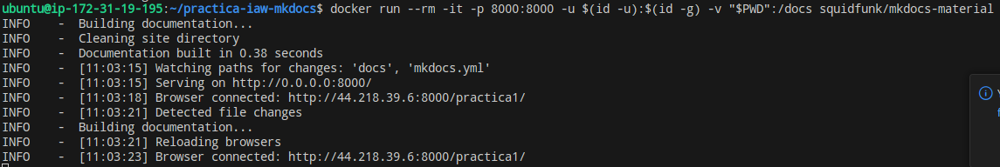
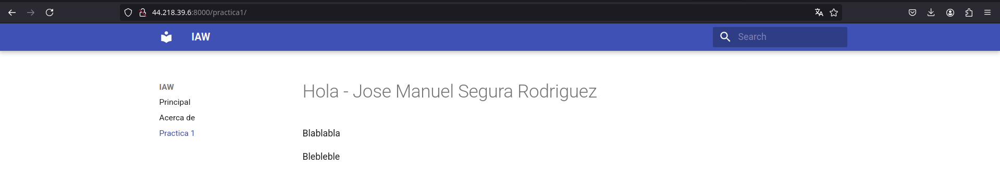
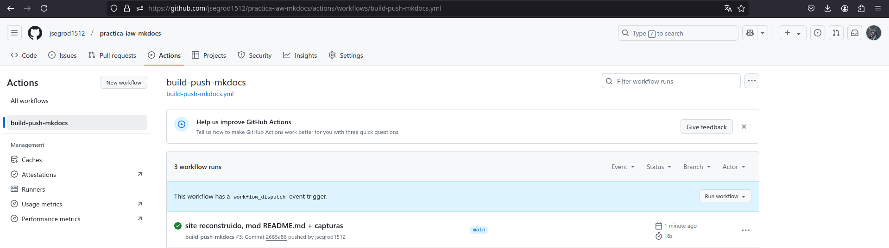

# practica-iaw-mkdocs

Repositorio para la práctica de Implantación de Aplicaciones Web (IAW) utilizando MkDocs y Docker.

## Descripción

Este proyecto tiene como objetivo crear un sitio web estático para la documentación del curso IAW, empleando MkDocs con el tema **Material for MkDocs**. Se utiliza Docker para facilitar la construcción y despliegue del sitio.

## Estructura del Proyecto

```
jsegrod1512-practica-iaw-mkdocs/
├── README.md
├── mkdocs.yml
├── docs/
│   ├── about.md
│   ├── index.md
│   └── practica1.md
├── site/
└── .github/
    └── workflows/
        └── build-push-mkdocs.yml
```

### Archivos y Directorios

- **README.md**: Este archivo que proporciona información sobre el proyecto.
- **mkdocs.yml**: Archivo de configuración principal de MkDocs.
- **docs/**: Directorio que contiene los archivos Markdown con el contenido de la documentación.
- **site/**: Directorio generado al ejecutar `mkdocs build`, que contiene el sitio web estático listo para ser publicado.
- **.github/workflows/**: Contiene el flujo de trabajo de CI/CD definido en `build-push-mkdocs.yml` para automatizar la construcción y publicación en GitHub Pages.

## Instalación y Uso

1. **Clonar el repositorio**:

   ```bash
   git clone https://github.com/jsegrod1512/practica-iaw-mkdocs.git
   cd practica-iaw-mkdocs
   ```

2. **Crear un nuevo proyecto MkDocs con Docker**:

   Ejecuta el siguiente comando para generar la estructura básica del proyecto:

   ```bash
   docker run --rm -it -p 8000:8000 --user $(id -u):$(id -g) -v "$PWD":/docs squidfunk/mkdocs-material new .
   ```

   Este comando realiza lo siguiente:

   - `--rm`: Elimina el contenedor después de su ejecución.
   - `-it`: Ejecuta el contenedor en modo interactivo.
   - `-p 8000:8000`: Mapea el puerto 8000 del contenedor al puerto 8000 de tu máquina local.
   - `--user $(id -u):$(id -g)`: Ejecuta el contenedor con el mismo UID y GID que el usuario actual, evitando problemas de permisos.
   - `-v "$PWD":/docs`: Monta el directorio actual (`$PWD`) en el directorio `/docs` del contenedor.
   - `squidfunk/mkdocs-material new .`: Utiliza la imagen `squidfunk/mkdocs-material` para crear un nuevo proyecto MkDocs en el directorio actual.

3. **Desarrollar el sitio localmente**:

   Inicia el servidor de desarrollo para previsualizar el sitio:

   ```bash
   docker run --rm -it -p 8000:8000 --user -v "$PWD":/docs squidfunk/mkdocs-material serve
   ```

4. **Generar la documentación estática**:

   Construye el sitio estático con:

   ```bash
   docker run --rm -it -v "$PWD":/docs squidfunk/mkdocs-material build
   ```

   El sitio generado se almacenará en el directorio `site/`.

5. **Desplegar en GitHub Pages**:

   El flujo de trabajo de CI/CD en GitHub Actions, definido en `.github/workflows/build-push-mkdocs.yml`, se encarga de desplegar automáticamente el sitio en la rama `gh-pages` al realizar un push a la rama `main`.

## Notas Adicionales

- **Permisos en Docker**: Al ejecutar Docker en sistemas Unix, es importante establecer los permisos adecuados para evitar problemas al acceder a los archivos generados. Utilizar la opción `--user $(id -u):$(id -g)` al ejecutar los comandos de Docker ayuda a mantener los permisos consistentes con el usuario actual.

- **Configuración de MkDocs**: El archivo `mkdocs.yml` se utiliza para configurar aspectos del sitio, como el nombre, la navegación y el tema. Asegúrate de personalizar este archivo según las necesidades de tu proyecto.

- **Contenido en Markdown**: Todos los archivos de contenido deben colocarse en el directorio `docs/`. Por ejemplo, `index.md` servirá como la página de inicio del sitio.


---

**Capturas de pantalla:**

- 

- 

- 