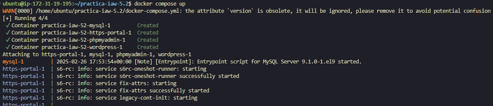
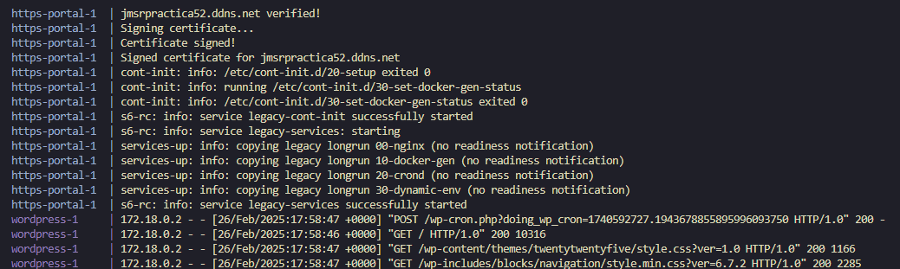
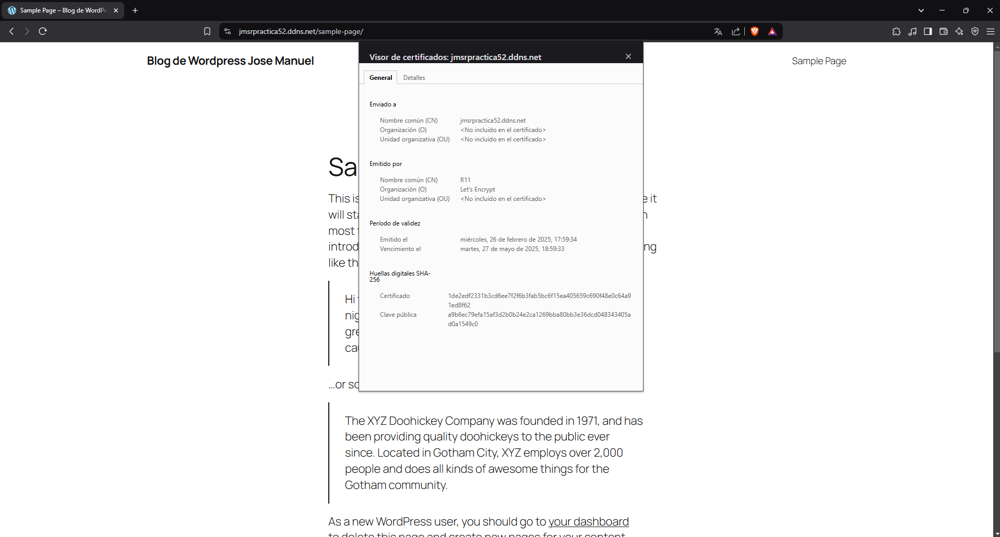

# practica-iaw-5.2

# Despliegue de WordPress con Docker y Docker Compose

## Script en docker-compose

Este script define el escenario de Docker Compose para desplegar un sitio web WordPress utilizando HTTPS habilitado a través de HTTPS-portal, junto con servicios adicionales como MySQL y phpMyAdmin.

---

### 1. Archivo `docker-compose.yml`

```yaml
version: '3.4'

services:
  mysql:
    image: mysql:9.1
    ports: 
      - 3306:3306
    environment: 
      - MYSQL_ROOT_PASSWORD=${MYSQL_ROOT_PASSWORD}
      - MYSQL_DATABASE=${WORDPRESS_DATABASE_NAME}
      - MYSQL_USER=${WORDPRESS_DATABASE_USER}
      - MYSQL_PASSWORD=${WORDPRESS_DATABASE_PASSWORD}
    volumes: 
      - mysql_data:/var/lib/mysql
    networks: 
      - backend-network
    restart: always
  
  phpmyadmin:
    image: phpmyadmin:5.2.1
    ports:
      - 8080:80
    environment: 
      - PMA_ARBITRARY=1
    networks: 
      - backend-network
      - frontend-network
    restart: always
    depends_on: 
      - mysql

  wordpress:
    image: bitnami/wordpress
    environment: 
      - WORDPRESS_DATABASE_HOST=${WORDPRESS_DATABASE_HOST}
      - WORDPRESS_DATABASE_USER=${WORDPRESS_DATABASE_USER}
      - WORDPRESS_DATABASE_PASSWORD=${WORDPRESS_DATABASE_PASSWORD}
      - WORDPRESS_DATABASE_NAME=${WORDPRESS_DATABASE_NAME}
      - WORDPRESS_BLOG_NAME=${WORDPRESS_BLOG_NAME}
      - WORDPRESS_USERNAME=${WORDPRESS_USERNAME}
      - WORDPRESS_PASSWORD=${WORDPRESS_PASSWORD}
      - WORDPRESS_EMAIL=${WORDPRESS_EMAIL}
    volumes:
      - wordpress_data:/var/www/html
    networks: 
      - backend-network
      - frontend-network
    restart: always
    depends_on: 
      - mysql

  https-portal:
    image: steveltn/https-portal:1
    ports:
      - 80:80
      - 443:443
    restart: always
    environment:
      DOMAINS: "${DOMAIN} -> http://wordpress:8080"
      STAGE: 'production' # No utilizar production hasta probar staging
      # FORCE_RENEW: 'true'
    networks:
      - frontend-network

volumes:
  mysql_data:
  wordpress_data:

networks: 
  backend-network:
  frontend-network:
```

---

### 2. Archivo `.env`

```env
MYSQL_ROOT_PASSWORD=root

DOMAIN=jmsrpractica52.ddns.net

WORDPRESS_DATABASE_HOST=mysql
WORDPRESS_DATABASE_USER=bn_wordpress
WORDPRESS_DATABASE_PASSWORD=bitnami
WORDPRESS_DATABASE_NAME=bitnami_wordpress
WORDPRESS_BLOG_NAME="Blog de Wordpress Jose Manuel"
WORDPRESS_USERNAME=user
WORDPRESS_PASSWORD=bitnami
WORDPRESS_EMAIL=josemanuellsr39@gmail.com
```

---

### 3. Despliegue y configuración

1. **Clonar el repositorio:**

   ```bash
   git clone https://github.com/jsegrod1512/practica-iaw-5.2.git
   cd practica-iaw-5.2
   ```

2. **Crear el archivo `.env`:**  
   Colocamos en la raíz del proyecto el archivo `.env` con las variables de entorno.

3. **Levantar los servicios:**

   ```bash
   docker-compose up -d
   ```

4. **Verificar el despliegue:**  
   - Accedemos a `https://jmsr-iawpractica52.ddns.net` para visualizar el sitio WordPress con HTTPS habilitado.

---

**Capturas de pantalla:**

- 

- 

- 